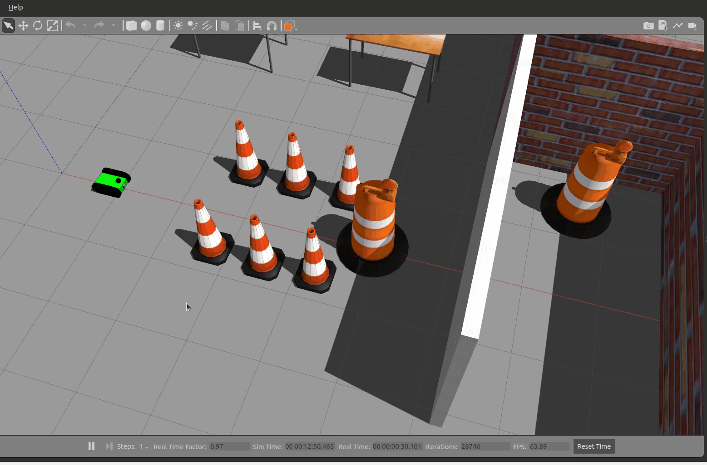
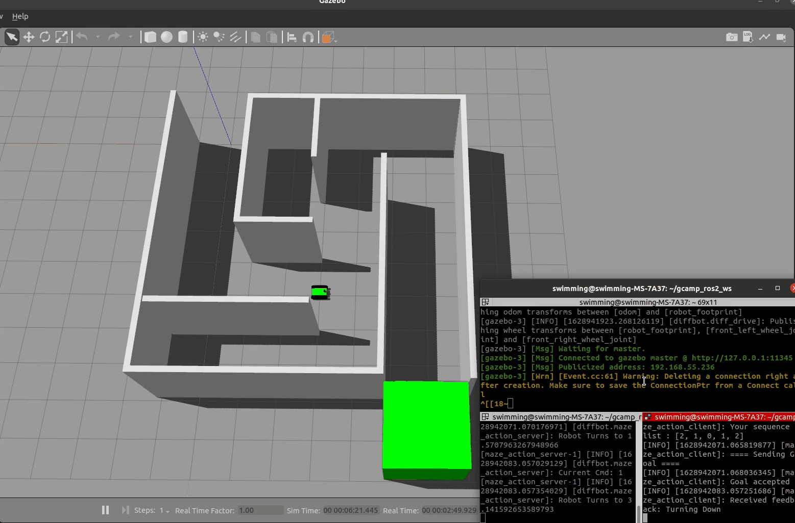
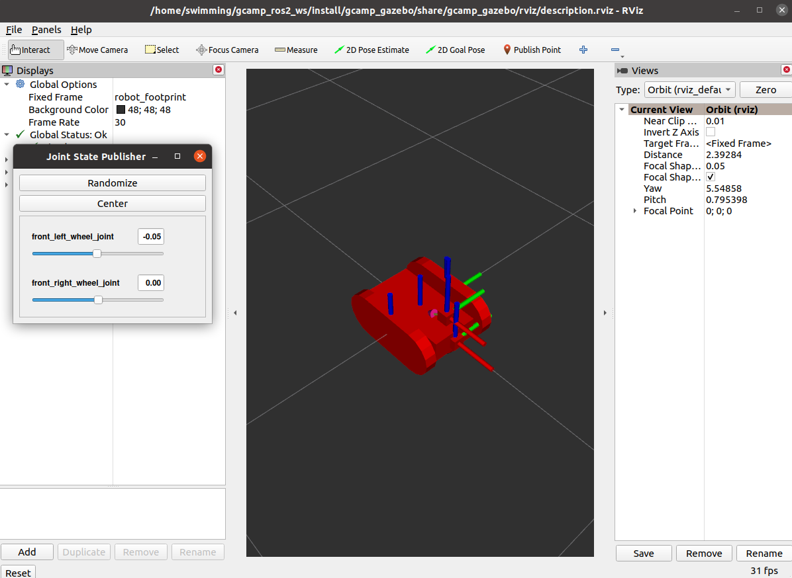
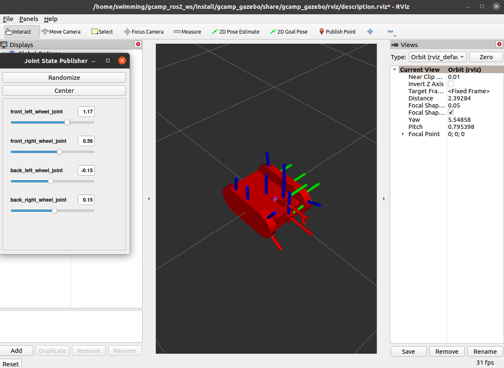

# GCamp ROS 2 Basic 

## ROS 2 Basics with Gazebo Simulations

> Feel Free to use this repo as an template code 😀

### News

There's Youtube Lecture note for all codes, all packages (**Written in Korean**) 
- [Youtube Playlist Link](https://www.youtube.com/watch?v=X9uYIumhU8E&list=PLieE0qnqO2kTNCznjLX_AaXe2hNJ-IpVQ)

There's Lecture note for all codes, all packages (**Written in Korean**) 
- [Lecture Note Notion Link](https://www.notion.so/ROS-2-for-G-Camp-6f86b29e997e445badb69cc0af825a71)

_Comming Soon... All process with *Windows OS*_

Repo Structure


```
├── cpp_first_pkg
├── cpp_topic_pkg
├── cpp_service_pkg
├── cpp_action_pkg
├── py_first_pkg
├── py_topic_pkg
├── py_service_pkg
├── py_action_pkg
├── custom_interfaces
├── gcamp_gazebo
└── image
```

* `gcamp_gazebo` :  Gazeobo Package with Worlds and Robot.
* `cpp_<sth>_pkg` : C++ ROS 2 packages for each ROS Communication Mechanisms
* `py_<sth>_pkg` : Python ROS 2 packages for each ROS Communication Mechanisms
* `custom_interfaces` : Package for custom ROS 2 communication interfaces

## Examples - `rclpy`

### Topic Examples

* Available nodes and Execution commands

```
ros2 run py_topic_pkg cmd_vel_pub_node 
ros2 run py_topic_pkg laser_raw_node 
ros2 run py_topic_pkg laser_sub_node
ros2 run py_topic_pkg parking_node
```

### Project - Parking 

Use ROS 2 topic to park the robot correctly in the simulation.

* LaserScan data Subscribe
* Twist publish

<p align="center">
    
</p>

### Service Examples

* Available nodes and Execution commands

```
ros2 run py_service_pkg gazebo_model_spawner
ros2 run py_service_pkg robot_turning_server
ros2 service call /turn_robot custom_interfaces/srv/TurningControl "{time_duration: 5, angular_vel_z: 1.0, linear_vel_x: 0.5}"
ros2 service call /delete_entity gazebo_msgs/srv/DeleteEntity "{name: 'skidbot'}"
ros2 run py_service_pkg robot_turning_client
```

### Project - Spawn Cloned Robot 

Use ROS 2 service to bring a robot into the simulation.

* ROS Gazebo Service
* Service Client
* URDF

<p align="center">
    
</p>

### Action Examples

* Available nodes and Execution commands

```
ros2 run py_action_pkg fibonacci_action_server 
ros2 run py_action_pkg fibonacci_action_client 
ros2 run py_action_pkg fibonacci_action_server_cancel 
ros2 run py_action_pkg fibonacci_action_client_cancel

ros2 action send_goal fibonacci custom_interfaces/action/Fibonacci "{order: 5}"
ros2 action send_goal --feedback fibonacci custom_interfaces/action/Fibonacci "{order: 5}"

ros2 run image_view image_view --ros-args --remap /image:=/diffbot/camera_sensor/image_raw
ros2 run py_action_pkg img_subscriber_node 
ros2 run py_action_pkg odom_sub_node 
ros2 run py_action_pkg robot_controller
ros2 run py_action_pkg maze_action_server
ros2 run py_action_pkg maze_action_client
ros2 action send_goal --feedback maze_action custom_interfaces/action/Maze "{turning_sequence: [2,1,0,1,2]}"
```

### Project - Maze Escape

Use ROS 2 action to get the robot out of the maze.

* Action Client & Server
* ROS 2 odometry
* OpenCV

<p align="center">
    
</p>

### Theory - Robot Dynamics

* Make skid_drive robot and differential_drive robot with URDF, and make them moving in Gazebo Environment.
* Check difference btw them

<p align="center">
    
    
</p>

## Update & TODO

- [ ] Tutorial for Windows Users


## Contributor
* Package Development : [kimsooyoung](https://github.com/kimsooyoung)
* Error Review & Contribution : [YoonSeok Pyo](https://github.com/robotpilot)
